## Overview

BetterModel follows a clean, layered architecture that separates concerns and enables multi-platform support. The codebase is organized into four main layers: API, Core, Platform, and NMS.

```mermaid
graph TD
    A[Your Plugin] --> B[API Layer]
    B --> C[Core Layer]
    C --> D[Platform Layer]
    D --> E[NMS Layer]
    E --> F[Minecraft Server]
    
    style B fill:#04ac5c
    style C fill:#1fd56c
    style D fill:#17221f
    style E fill:#333
```



## Module Structure

<Accordion title="API Layer" icon="book-open">
  **Location:** `api/` and `api/bukkit-api/`
  
  The API layer defines contracts and interfaces without implementation details:
  
  - Pure interfaces and data classes
  - No platform-specific dependencies
  - Stable public API surface
  - Published to Maven Central
  
  **Key packages:**
  - `kr.toxicity.model.api` - Core API classes
  - `kr.toxicity.model.api.tracker` - Tracker interfaces
  - `kr.toxicity.model.api.animation` - Animation system
  - `kr.toxicity.model.api.bone` - Bone manipulation
  - `kr.toxicity.model.api.bukkit` - Bukkit-specific adapters
</Accordion>

<Accordion title="Core Layer" icon="microchip">
  **Location:** `core/` and `core/bukkit-core/`
  
  The core layer implements the API contracts:
  
  - Business logic and orchestration
  - Model loading and parsing
  - Animation processing
  - Resource pack generation
  - Platform-agnostic implementation
  
  **Responsibilities:**
  - BlockBench `.bbmodel` file parsing
  - Animation keyframe interpolation
  - Packet bundling and optimization
  - Resource management
</Accordion>

<Accordion title="Platform Layer" icon="layer-group">
  **Location:** `platform/paper/`, `platform/spigot/`, `platform/fabric/`
  
  Platform-specific implementations and integrations:
  
  - Server lifecycle management
  - Plugin/mod loading
  - Platform-specific optimizations
  - Event system integration
  
  **Platform modules:**
  - **Paper** - Modern async scheduler, optimized packet handling
  - **Spigot** - Legacy scheduler compatibility
  - **Fabric** - Mod loader integration, Polymer resource packs
</Accordion>

<Accordion title="NMS Layer" icon="wrench">
  **Location:** `nms/v1_21_R1/`, `nms/v1_21_R3/`, etc.
  
  Version-specific Minecraft internals access:
  
  - Packet manipulation
  - Entity spawning
  - Display entity control
  - Network protocol handling
  
  **Supported versions:** 1.21 through 1.21.11
</Accordion>

## Data Flow

<Steps>
  <Step title="Model Loading">
    Core layer reads `.bbmodel` files from disk and parses the JSON structure into internal data models.
  </Step>
  
  <Step title="Resource Generation">
    Core layer generates optimized resource pack with custom model data and textures.
  </Step>
  
  <Step title="Tracker Creation">
    API user creates a tracker through `ModelRenderer`. Core layer instantiates the appropriate tracker type (Entity/Dummy).
  </Step>
  
  <Step title="Rendering">
    NMS layer spawns item display entities and sends packets to connected players. Platform layer handles scheduling.
  </Step>
  
  <Step title="Animation">
    Core layer interpolates animation keyframes. NMS layer sends transformation packets at 40Hz (TRACKER_TICK_INTERVAL).
  </Step>
</Steps>

## Design Principles

<CardGroup cols={2}>
  <Card title="Separation of Concerns" icon="layer-group">
    Each layer has a single responsibility and doesn't leak implementation details.
  </Card>
  
  <Card title="Dependency Direction" icon="arrow-right">
    Dependencies flow one way: API ← Core ← Platform ← NMS
  </Card>
  
  <Card title="Platform Abstraction" icon="cloud">
    Platform-specific code is isolated, allowing easy addition of new platforms.
  </Card>
  
  <Card title="Version Isolation" icon="code-branch">
    NMS version differences are contained in separate modules.
  </Card>
</CardGroup>

## Key Components

### BetterModelPlatform

The platform singleton provides access to all managers:

```java
BetterModelPlatform platform = BetterModel.platform();

// Access managers
ModelManager models = platform.modelManager();
PlayerManager players = platform.playerManager();
ProfileManager profiles = platform.profileManager();
```

### Model Manager

Loads and manages model renderers:

- Discovers `.bbmodel` files in `BetterModel/models/` and `BetterModel/players/`
- Caches parsed models
- Provides lookup by name
- Handles hot-reloading

### Tracker System

Manages model instances (see [Trackers](/concepts/trackers)):

- **EntityTracker** - Attached to entities, follows movement
- **DummyTracker** - Standalone at fixed locations
- **EntityTrackerRegistry** - Per-entity tracker collection

### Render Pipeline

Orchestrates rendering for a single model instance:

- Manages bone hierarchy
- Coordinates packet sending
- Handles player visibility
- Processes animations

## Thread Safety

<Warning>
  BetterModel uses asynchronous design for performance. Most operations are thread-safe, but tracker modification should happen on the main thread or within scheduled tasks.
</Warning>

### Async Operations

- Model loading and parsing
- Resource pack generation
- Profile resolution (player skins)

### Sync Operations

- Tracker creation and modification
- Entity manipulation
- Player-specific operations

### Folia Considerations

On Folia, operations are region-specific:

```java
// Use region-safe task scheduling
tracker.location().task(() -> {
    // This runs in the correct region
    tracker.animate("attack");
});
```

## Extension Points

<Accordion title="Custom Render Sources">
  Implement `RenderSource` to create custom model sources beyond entities and locations.
</Accordion>

<Accordion title="Animation Scripts">
  Use Molang expressions in animations for dynamic, data-driven behavior.
</Accordion>

<Accordion title="Custom Update Actions">
  Implement `TrackerUpdateAction` for custom display modifications.
</Accordion>

<Accordion title="Event Handling">
  Subscribe to BetterModel events through `BetterModelEventBus` for lifecycle hooks.
</Accordion>

## Best Practices

<Tip>
  Follow the existing module boundaries when contributing. API changes require careful consideration of backward compatibility.
</Tip>

<Note>
  For detailed architectural guidelines, see the [AGENTS.md](https://github.com/toxicity188/BetterModel/blob/main/AGENTS.md) file in the repository.
</Note>

## See Also

<CardGroup cols={2}>
  <Card title="Models & Renderers" icon="cube" href="/concepts/models-and-renderers">
    Learn about the model loading system
  </Card>
  <Card title="Trackers" icon="crosshairs" href="/concepts/trackers">
    Understand tracker lifecycle and types
  </Card>
  <Card title="API Reference" icon="code" href="/api/bettermodel">
    Explore the complete API
  </Card>
</CardGroup>